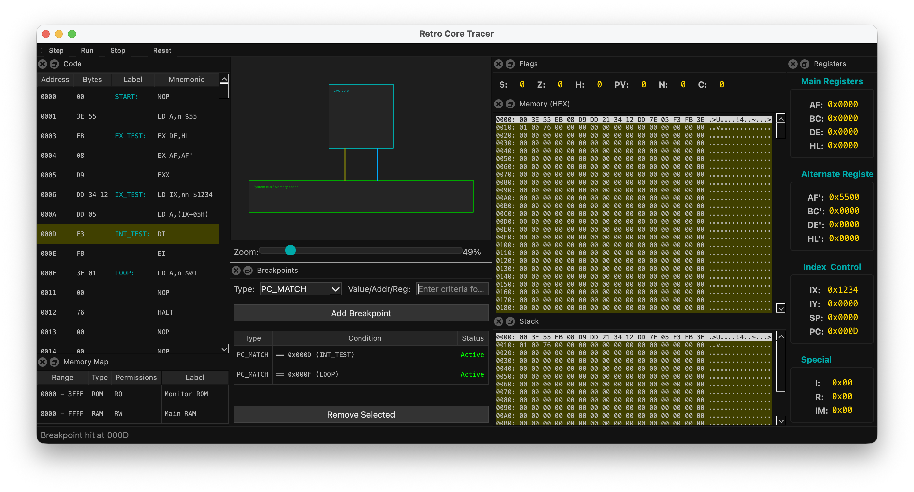
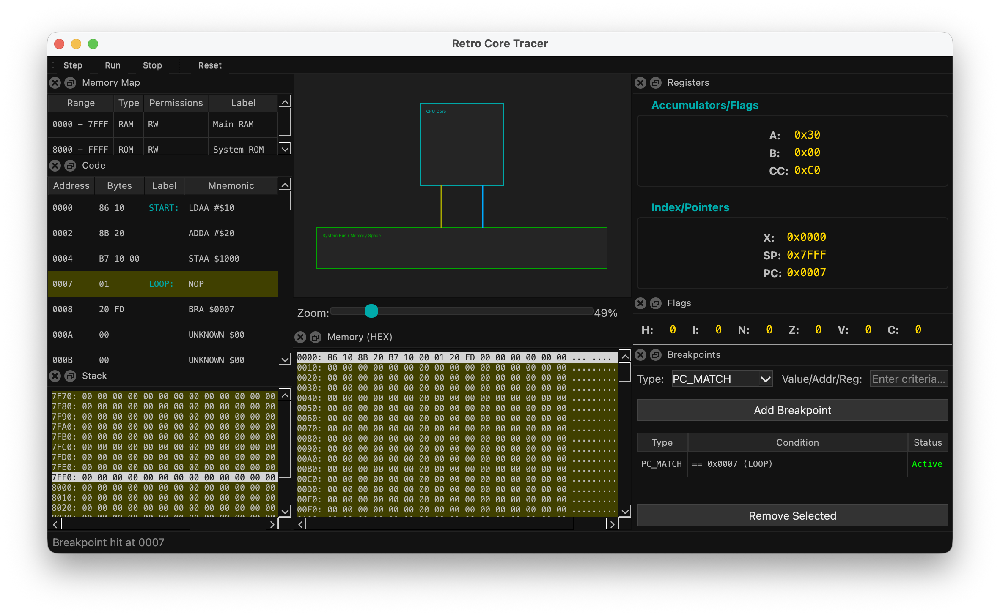

# Retro Core Tracer

**「計算の本質を可視化する」**

Retro Core Tracerは、CPUエミュレーションの内部動作（レジスタ、バス、フラグ、スタック）をリアルタイムかつ詳細に可視化するための教育的ツールです。単に命令を実行するだけでなく、「ビットの羅列がどのように意味を持ち、回路を駆動するか」というプロセスを透明化することを目的としています。

### Z80 Mode


### MC6800 Mode


## ✨ 特徴

*   **マルチアーキテクチャ対応基盤:** UI層が特定のCPU実装から完全に分離されており、メタデータ駆動（Data-Driven）で動的にレジスタやフラグを表示します。現在は **Z80** および **MC6800** に対応しています。
*   **教育的透明性 (Transparency):** レジスタの変化、フラグの更新、スタックの積み上げなど、CPUの内部状態を隠さず全て表示します。
*   **Pure Bus Logging (純粋なバス監視):** UI描画のためのメモリ読み出し（Peek）と、CPUによる実際の実行アクセス（Read/Write）を厳密に区別。**「画面上でバスが光った＝確実にCPUがアクセスした」** という信頼性を提供します。
*   **Visualized Block Transfer:** `LDIR` などのブロック転送命令において、結果を一括更新するのではなく、1バイト転送ごとにステップ実行が可能。データがメモリ上を流いていく様子をアニメーションのように観察できます。
*   **Snapshotベースの可視化:** 1命令ごとのCPU状態を不変（Immutable）なスナップショットとして記録。UIとコアロジックが完全に分離されています。
*   **モダンで柔軟なUI:** PySide6 (Qt) を採用。ドラッグ＆ドロップで各ビューを自由に配置（上下分割・タブ化）できるドッキングウィンドウシステムを搭載。
*   **直感的なデバッグ操作:**
    *   **Breakpoints:** PC一致、メモリ読み書き、レジスタ変化など、柔軟な条件設定。
    *   **Code View:** アーキテクチャに依存しない汎用的な逆アセンブラ表示。実行予定の次行が常に見えるスマートスクロール機能を搭載。
    *   **HEX / Register / Flag / Stack / Memory Map View:** 全ての内部状態をリアルタイムに可視化。

### 対応するアーキテクチャと命令セット

#### **Z80**
*   **転送命令:** `LD r,n`, `LD r,r'`, `LD ss,nn`, `LD HL,nn`, `PUSH`, `POP`
*   **インデックスレジスタ (`DD`/`FD`):** `LD IX/IY,nn`, `LD A,(IX+d)`, `ADD IX,ss`, `INC IX` 等
*   **交換命令:** `EX DE,HL`, `EX AF,AF'`, `EXX`, `EX (SP),HL`
*   **演算命令:** `INC`, `DEC`, `ADD A,r`, `SUB`, `ADC`, `SBC`, `AND`, `OR`, `XOR`, `CP`, `ADD HL,ss`
*   **分岐命令:** `JP nn`, `JR e`, `JR cc,e`, `DJNZ`, `CALL`, `RET`
*   **ビット操作 (`CB`):** `BIT`, `SET`, `RES`, `RLC`, `RRC`, `RL`, `RR`, `SLA`, `SRA`, `SRL`
*   **ブロック転送 (`ED`):** `LDI`, `LDIR`, `LDD`, `LDDR`
*   **I/O命令:** `IN A,(n)`, `OUT (n),A`
*   **割り込み制御:** `EI`, `DI`, `IM 0/1/2`, `RETI`, `RETN`
*   **その他:** `NOP`, `HALT`

#### **MC6800**
*   **転送命令:** `LDAA`, `LDAB`, `LDX`, `STAA`
*   **演算命令:** `ADDA`, `ANDA`, `INCB`
*   **分岐・制御:** `BRA`, `BNE`, `NOP`
*   *(※主要な命令から順次実装中)*

## 🚀 インストール

### 前提条件
*   Python 3.10 以上

### 手順

1.  リポジトリをクローンします。
    ```bash
    git clone https://github.com/yourusername/RetroCoreTracer.git
    cd RetroCoreTracer
    ```

2.  仮想環境を作成し、有効化することをお勧めします。
    ```bash
    # Mac/Linux
    python3 -m venv venv
    source venv/bin/activate

    # Windows (PowerShell)
    python -m venv venv
    .\venv\Scripts\Activate.ps1
    ```

3.  依存パッケージをインストールします。
    ```bash
    pip install -r requirements.txt
    ```

## 🎮 使い方

プロジェクトのルートディレクトリで以下のコマンドを実行し、アプリケーションを起動します。

```bash
# Mac/Linux
export PYTHONPATH=$(pwd)/src
python3 -m retro_core_tracer.ui.app

# Windows (PowerShell)
$env:PYTHONPATH="$(pwd)\src"
python -m retro_core_tracer.ui.app
```

### 基本操作
1.  **Load Config:** `File` -> `Load Config...` からシステム構成（YAML）を読み込みます。例: `examples/mc6800_system_config.yaml`
2.  **Load HEX/Assembly:** `File` -> `Load HEX...` または `Load Assembly...` からプログラムを読み込みます。アセンブリ形式を読み込むと、ラベル情報がデバッガ上でシンボルとして表示されます。
3.  **Run/Step/Reset:** ツールバーのボタンで実行制御を行います。
    *   `Step`: 1命令ずつ実行します。
    *   `Run`: 連続実行します。
    *   `Stop`: 実行を停止します。
    *   `Reset`: CPUの状態を初期化します。
4.  **Breakpoints:** `Breakpoints` タブで条件を追加し、特定の状態で実行を一時停止できます。

## 🛠️ 開発について

このプロジェクトは **「マニフェスト駆動開発」** を採用しています。
コードの変更を行う前に、対応する `ARCHITECTURE_MANIFEST.md`（各ディレクトリに配置）を更新し、設計意図（Intent）を明確にする規律を守っています。

### ディレクトリ構造
このプロジェクトはフラクタルなマニフェスト構造を採用しています。各ディレクトリの設計詳細は、それぞれの `ARCHITECTURE_MANIFEST.md` を参照してください。

*   `src/retro_core_tracer/`
    *   [`transport/`](src/retro_core_tracer/transport/ARCHITECTURE_MANIFEST.md): バスとメモリデバイス。
    *   [`core/`](src/retro_core_tracer/core/ARCHITECTURE_MANIFEST.md): 抽象CPUコアとSnapshot定義。
    *   [`arch/z80/`](src/retro_core_tracer/arch/z80/ARCHITECTURE_MANIFEST.md): Z80固有の実装。
    *   [`arch/mc6800/`](src/retro_core_tracer/arch/mc6800/ARCHITECTURE_MANIFEST.md): MC6800固有の実装。
    *   [`debugger/`](src/retro_core_tracer/debugger/ARCHITECTURE_MANIFEST.md): 実行制御とブレークポイント。
    *   [`loader/`](src/retro_core_tracer/loader/ARCHITECTURE_MANIFEST.md): HEX/Assemblyローダー。
    *   [`ui/`](src/retro_core_tracer/ui/ARCHITECTURE_MANIFEST.md): PySide6による汎用ユーザーインターフェース。
*   `examples/`: サンプルプログラムと構成ファイル。
*   `tests/`: 各コンポーネントのユニットテスト。
*   `ARCHITECTURE_MANIFEST.md`: ルートマニフェスト（プロジェクト全体の憲法）。

---

## Attribution

This project was created with the assistance of
[`CIP`](https://github.com/sirosiro/cip) (Core-Intent Prompting Framework),
a CC BY 4.0 licensed prompt framework for generative AI.
