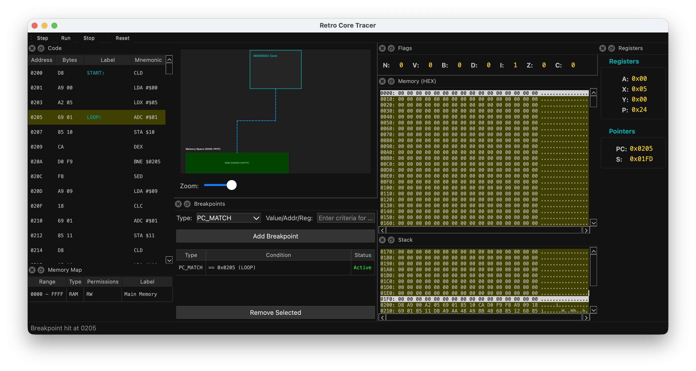

# Retro Core Tracer

**「計算の本質を可視化する」**

Retro Core Tracerは、CPUエミュレーションの内部動作（レジスタ、バス、フラグ、スタック）をリアルタイムかつ詳細に可視化するための教育的ツールです。

## ✨ 特徴

*   **マルチアーキテクチャ対応基盤:** UI層が特定のCPU実装から完全に分離されており、メタデータ駆動で動的に表示します。現在は **Z80**, **MC6800**, **MOS 6502** に対応しています。
*   **教育的透明性 (Transparency):** レジスタの変化、フラグの更新、スタックの積み上げなど、CPUの内部状態を隠さず全て表示します。
*   **Pure Bus Logging (純粋なバス監視):** UI描画のためのメモリ読み出し（Peek）と、CPUによる実際の実行アクセス（Read/Write）を厳密に区別します。
*   **Visualized Block Transfer:** `LDIR` などのブロック転送命令において、1バイト転送ごとにステップ実行が可能。
*   **Snapshotベースの可視化:** 1命令ごとのCPU状態を不変（Immutable）なスナップショットとして記録。
*   **モダンで柔軟なUI:** PySide6 (Qt) を採用したドッキングウィンドウシステム。
*   **直感的なデバッグ操作:**
    *   **Breakpoints:** PC一致、メモリ読み書き、レジスタ変化など。
    *   **Code View:** 実行予定の次行が常に見えるスマートスクロール機能。
    *   **Multiple Loaders:** Intel HEX, Motorola S-Record, 簡易アセンブラをサポート。

### 対応するアーキテクチャと命令セット

#### **Z80**

*   **特徴:** 8bit CPU, 16bit Address Bus, Separate I/O Space, リッチなレジスタセット (AF, BC, DE, HL + 裏レジスタ)。
*   **命令セット:** 転送(`LD`, `LDIR`), 演算(`ADD`, `SUB`, `INC`, `DEC`), ビット操作(`SET`, `RES`, `BIT`), 分岐(`JP`, `JR`, `CALL`, `RET`) など、主要命令を網羅。

#### **MC6800**

*   **特徴:** 8bit CPU, Big Endian, Memory Mapped I/O, シンプルなレジスタ構成 (A, B, X, PC, SP, CC)。
*   **命令セット:** 転送(`LDA/B`, `STA/B`, `LDX`, `STX`), 演算(`ADD`, `SUB`, `AND`, `ORA`), 分岐(`BRA`, `BNE`, `JMP`, `JSR`) など。

#### **MOS 6502**

*   **特徴:** 8bit CPU, Little Endian, Memory Mapped I/O, Accumulator + Index Registers (X, Y), Page Zero活用, Stack固定ページ ($01xx)。
*   **命令セット:** 転送(`LDA`, `LDX`, `LDY`, `STA`), 演算(`ADC`, `SBC` ※BCD対応), 分岐(`BCC`, `BCS`, `JMP`), スタック操作(`PHA`, `PLA`) など。
*   **教育的機能:** BCD演算時のフラグ挙動、JMP Indirectバグの再現、スタックポインタの物理アドレス補正表示。

## 🚀 インストール & 使い方

### 前提条件
*   Python 3.10 以上

### 手順
1.  `pip install -r requirements.txt`
2.  `export PYTHONPATH=$(pwd)/src`
3.  `python3 -m retro_core_tracer.ui.app`

### 基本操作
1.  **Load Config:** `File` -> `Load Config...` (例: `examples/mos6502_system_config.yaml`)
2.  **Load Program:** HEXファイルやアセンブリソースをロード。
3.  **Run/Step:** ツールバーで実行制御。

## 🛠️ 開発について
このプロジェクトは **「マニフェスト駆動開発」** を採用しています。変更前に必ず `ARCHITECTURE_MANIFEST.md` を更新し、設計意図（Intent）を明確にしてください。

### ディレクトリ構造と各マニフェスト
*   `src/retro_core_tracer/`
    *   [`transport/`](src/retro_core_tracer/transport/ARCHITECTURE_MANIFEST.md): バスとメモリデバイス（RAM/ROM）。
    *   [`core/`](src/retro_core_tracer/core/ARCHITECTURE_MANIFEST.md): 抽象CPUコア。
    *   `arch/`: アーキテクチャ固有実装。
        *   [`z80/`](src/retro_core_tracer/arch/z80/ARCHITECTURE_MANIFEST.md)
        *   [`mc6800/`](src/retro_core_tracer/arch/mc6800/ARCHITECTURE_MANIFEST.md)
        *   [`mos6502/`](src/retro_core_tracer/arch/mos6502/ARCHITECTURE_MANIFEST.md)
    *   [`debugger/`](src/retro_core_tracer/debugger/ARCHITECTURE_MANIFEST.md): デバッガロジック。
    *   [`loader/`](src/retro_core_tracer/loader/ARCHITECTURE_MANIFEST.md): 各種バイナリローダーとFactory。
    *   [`config/`](src/retro_core_tracer/config/ARCHITECTURE_MANIFEST.md): システム構成定義。
    *   [`ui/`](src/retro_core_tracer/ui/ARCHITECTURE_MANIFEST.md): PySide6によるUI。

---
## Attribution
This project was created with the assistance of [`CIP`](https://github.com/sirosiro/cip) (Core-Intent Prompting Framework).